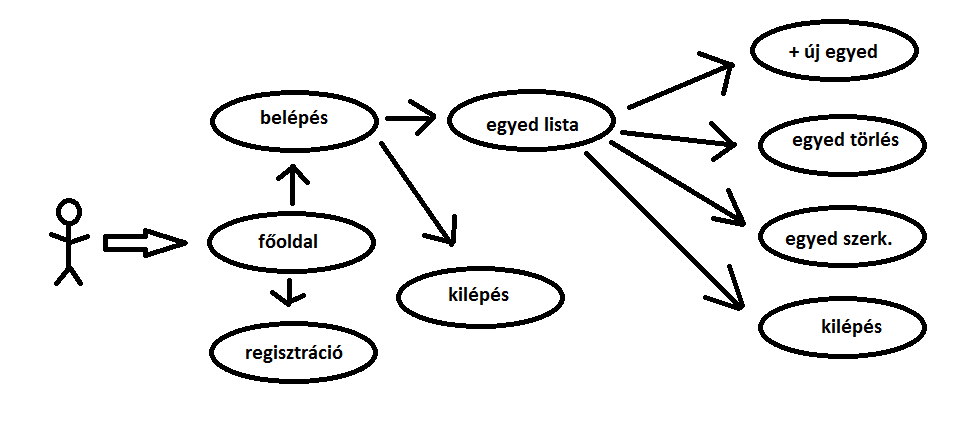
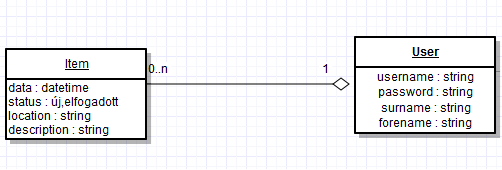
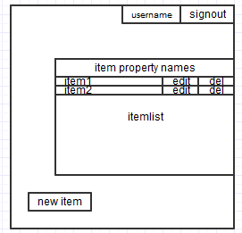

     ,-----.,--.                  ,--. ,---.   ,--.,------.  ,------.
    '  .--./|  | ,---. ,--.,--. ,-|  || o   \  |  ||  .-.  \ |  .---'
    |  |    |  || .-. ||  ||  |' .-. |`..'  |  |  ||  |  \  :|  `--, 
    '  '--'\|  |' '-' ''  ''  '\ `-' | .'  /   |  ||  '--'  /|  `---.
     `-----'`--' `---'  `----'  `---'  `--'    `--'`-------' `------'
    ----------------------------------------------------------------- 

Welcome to your Node.js project on Cloud9 IDE!

This chat example showcases how to use `socket.io` with a static `express` server.

## Running the server

1) Open `server.js` and start the app by clicking on the "Run" button in the top menu.

2) Alternatively you can launch the app from the Terminal:

    $ node server.js

Once the server is running, open the project in the shape of 'https://projectname-username.c9.io/'. As you enter your name, watch the Users list (on the left) update. Once you press Enter or Send, the message is shared with all connected clients.

about:
Simulates a warehouse where you can enter as an employee, and manage the items in the warehouse.
the program is made for a course, requirements were:

-at least two model in 1->n relation
-at least one page for user to fill
-opportunity for user to create object
-edit object
-delete object
-page available only after authentication
-data persisting to file

user usecases:

Upon entering the website the user find himself on the index page, he is able to register a new user there.
After logging in they find themselves on the warehouse list page where: 
-they can add entitys to the warehouse, they can give it a location and a description.
-they can edit existing items, and delete them.
-and finally log out

hardware stats for developing:
default pc requirements for using c9.io

softwares used for developing:
c9.io
windows 7 

minimal software requirements for running the app:
-pentium 4
-1 GB ram
-gfx card capable of 1024*768 resolution

additional requirements:
interactive user interface,easy handling

database plan:

to run:
-any OS
-nodeJS
-install packages
  -npm install <package name>  command

packages used:
-bcryptjs 2.3.0
-body-parser 1.14.1
-chai 3.3.0
-connect-flash 0.1.1
-express 4.13.3
-express-session 1.11.3
-express-validator 2.17.1
-hbs 3.1.1
-passport 0.3.0
-passport-local 1.0.0
-sails-disk 0.10.8
-sails-memory 0.10.5
-mocha 2.3.3
-zombie 4.1.0
-waterline 0.10.26

TEST:
-test.js
-models/user.test.js

ui sketch:

